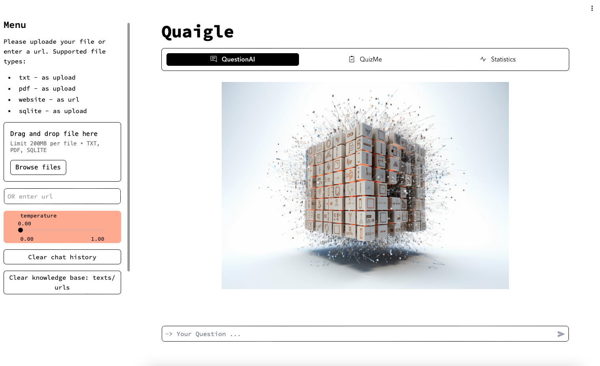
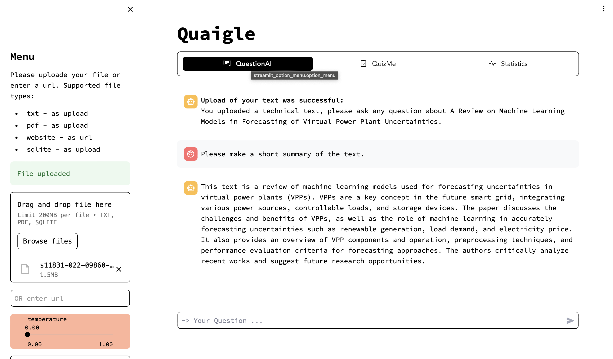
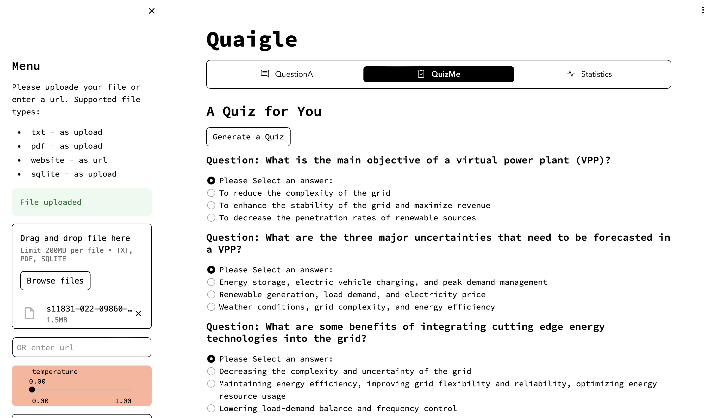
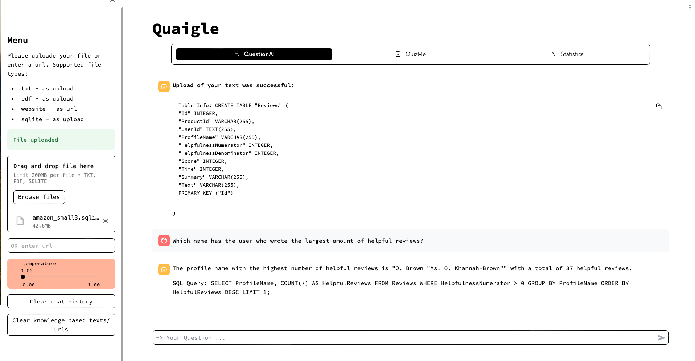

# Quaigle - Your Talk-to-Your-Document Companion

**Welcome to Quaigle!** Quaigle is a versatile program for text-based interactions with documents, whether text documents (txt, pdf or a url to a static website) or databases. It leverages the new evolving technology of generative AI and uses the Generative Pre-trained Transformer 3 (gpt-3.5-turbo & gpt-3.5-turbo-instruct) LLM  to answer your questions about the uploaded documents. It extracts insights from your documents, gives you a quiz about the content or harness the power of natural language based querying of databases.

## Table of Contents

- [Features](#features)
  - [Query Text with LlamaIndex CondenseQuestionChatEngine](#query-Text)
  - [Create Quizzes with LangchainOutputParser](#create-quizzes)
  - [Query SQL Databases with Langchain SQLDatabaseChain](#query-sql-databases)
  - [Streamlit User Interface](#streamlit-user-interface)
- [Continuous Deployment with GitHub Actions](#continuous-deployment)
- [Future Improvements](#future-improvements)

## Features

### Query Text with LlamaIndex CondenseQuestionChatEngine

Quaigle allows for uploading text in several formats, such as TXT and PDF files or through a URL. The text will be embedded and stored to a vector database. While embedding a marvin ai-model determines its category and main subject. Keep in mind that costs will arise the longer the text documents are. All text data is stored in the same vector database, you can upload different files or urls, the context will be combined for answering your questions.
A LlamaIndex CondenseQuestionChatEngine with RetrieverQueryEngine is used to extract relevant context from the vector database which is then used for querying the openai API. 

### Create Quizzes with LangchainOutputParser

Using the data from a text source (PDF, TXT, or URL), also a quizz can be generated. Quaigle backend provides structured output for quizzes, gained from LlangchainOutputParser, which is seamlessly integrated to the frontend quiz interface.

### Query SQL Databases with Langchain SQLDatabaseChain

Quaigle supports querying a SQLite database by natural language, which is a powerful tool for data-driven questions and makes databases accessible to everyone. The size of the uploadable database is currently limited by the frontend (max 40MB), but with optimal frontend scaling no limit is set. A Langchain SQLDatabaseChain with Runnables is used to provide natural language answers. For conveniance also the used SQL query is given as output.

## Continuous Deployment with GitHub Actions

Quaigle is deployed via CI/CD using GitHub Actions and Pulumi for infrastructure as code to deploy the backend to an AWS EC2 instance. The frontend is hosted on fly.io. Changes in the frontend, backend, or infrastructure trigger automated updates to the hosted application.

## Streamlit User Interface 

## Future Improvements
- Possible future improvement on quality of quiz-questions:
  using  Llamaindex DatasetGenerator and RelevancyEvaluator in combination with gpt4 to generate the list of questions of relevance that could be asked about the data won't have to stick the questions to the main subject of the text
  https://gpt-index.readthedocs.io/en/latest/examples/evaluation/QuestionGeneration.html
  https://betterprogramming.pub/llamaindex-how-to-evaluate-your-rag-retrieval-augmented-generation-applications-2c83490f489
- Improvement for text Embedding with training data (EmbeddingAdapterFinetuneEngine): https://levelup.gitconnected.com/enhancing-rag-through-llamaindexs-blueprint-for-effective-embedding-and-llm-fine-tuning-a5b19f9cdeb0
- for website talking: as soon as a better/free website reader is available on LlamaHub, especially for dynamic websites, this can easily be implemented.
