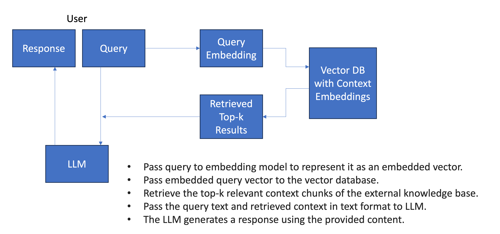

# Quaigle

Quaigle is a RAG-based LLM application and a project to explore different frameworks to provide generative AI with additional knowledge sources outside of its own training data. 


In general, Retrieval Augmented Generation (RAG) enables more factual consistency, improves reliability of the generated responses, and helps to mitigate the problem of "hallucinations". 

>In this project, RAG is used to specialize on a specific context and to answer questions about uploaded documents.

The external data sources can originate from multiple files, and may exist in different formats like:
- txt-files, 
- pdf-files  or 
- websites (currently limited to only static).   

These data sources are converted into numerical vector representations, called embeddings, and stored in a vector database. 

Vector databases empower **semantic search:** instead of relying on exact keyword matching, the actual meaning of the query is considered. Through the encoding of the (text) data into meaningful vector representations, the distances between vectors reflect the similarities between the elements. Utilizing algorithms like Approximate Nearest Neighbor (ANN), they enable rapid retrieval of results that closely match the query, facilitating efficient and precise searches.



In addition to RAG, this project also explores **querying with functions** to interact with 
- SQL databases  

using natural language.

## Frameworks and Techniques
In this project, the llm frameworks:
- LangChain, 
- LLamaIndex and
- Marvin  

were examined and utilized according their (current: 11/2023) strengths in the scope of RAG and querying with functions (to interact with a sql database).

### LLamaIndex:
LLamaIndex turned out to be the most straight-forward approach to transform external data into embeddings and store them in a persistent vector database and to set up a stateful chat agent. The general approach needed only some lines of code.
### LangChain
LangChains approach of chaining together different components/ functions to create more advanced LLM applications like querying a database with natural language turned out to be powerful. The chain characteristic allows to give the llm a specific procedure as instruction, which makes this approach very explicit.
### Marvin:
Marvins strenghts are both, classification and structured output. The reason why it is not used for generating the multiple choice questions (which exactly need structured output for the further use in this project) is because of  the more difficult approach to connect to the vector database, which is possible, but not straight forward with the pure marvin library. But marvin is used in this project for the extraction and augmentation of metadata about the given text, which is used for the vector index retriever.
  
### The different Tasks:
- [Text-Querying with LlamaIndex CondenseQuestionChatEngine and marvin classification](#text-querying-with-llamaindex-condensequestionchatengine)
- [Generating Multiple-Choice Questions (Structured Output) on given context with LlamaIndex and the Langchain PydanticOutputParser](#generating-multiple-choice-questions-on-given-context-with-langchainoutputparser)
- [Natural Language Querying SQL Databases with Langchain SQLDatabaseChain](#querying-sql-databases-with-langchain-sqldatabasechain)
- [Future Improvements](#future-improvements)

Tech Stack
- [Streamlit User Interface](#streamlit-user-interface)
- FastAPI Backend
- Docker Containerization 
- [Continuous Deployment with GitHub Actions](#continuous-deployment-with-github-actions)


### Text-Querying with LlamaIndex CondenseQuestionChatEngine

A LlamaIndex CondenseQuestionChatEngine with RetrieverQueryEngine is used to extract relevant context from the vector database, which is then used for querying the openai API. 

As a chat engine, it is a high-level interface for having a conversation with your data (multiple back-and-forth instead of a single question & answer) like with ChatGPT, but augmented with your own knowledge base. It is stateful and keeps track of the conversation history.

The following two concepts for performant RAG applications "Decoupling Chunks Used for Retrieval" and "Chunks Used for Synthesis" are both used here: 
The CondenseQuestionChatEngine is responsible for *synthesis*, while the RetrieverQueryEngine handles *retrieval*. The RetrieverQueryEngine uses a VectorIndexRetriever with a VectorStoreIndex, which is based on nodes. These nodes are chunks that were parsed by the SimpleNodeParser.

By using this setup, the chunks used for retrieval (handled by the RetrieverQueryEngine) are decoupled  from the chunks used for synthesis (handled by the CondenseQuestionChatEngine). This allows for more efficient and accurate retrieval of relevant documents before retrieving the specific chunks needed for synthesis.

-> https://gpt-index.readthedocs.io/en/latest/end_to_end_tutorials/dev_practices/production_rag.html

#### But let's start from the beginning and clearify the tasks of the different components used:

- A **SimpleNodeParser** is used first, which is a tool used in the LlamaIndex library to chunk documents into smaller nodes that can be used for indexing and retrieval purposes. It allows for more efficient processing and retrieval of information from large documents. It takes a list of documents and splits them into nodes of a specific size, with each node inheriting the attributes of the original document, such as metadata, text, and metadata templates.   
- The chunking is done using a **TokenTextSplitter**, with a default chunk size of 1024 tokens and a chunk overlap of 20 tokens.  
- The **MetadataExtractor** is used in the LlamaIndex library to extract contextual information from documents and add it as metadata to each node.

- The **VectorStoreIndex** enables efficient indexing and querying of documents based on vector stores. It is a component that allows for the construction and querying of indexes based on vector stores. It is used to store embeddings for input text chunks and provides a query interface for retrieval, querying, deleting, and persisting the index.  
The VectorStoreIndex can be constructed upon any collection of documents and uses a vector store within the index to store the embeddings. By default, it uses an in-memory SimpleVectorStore that is initialized as part of the default storage context. However, it also supports various other vector stores such as DeepLake, Elasticsearch, Redis, Faiss, Weaviate, Zep, Pinecone, Qdrant, Cassandra, Chroma, Epsilla, Milvus, and Zilliz.  
Once the index is constructed, you can use it for querying by creating a query engine and executing queries:

```
# Query index
query_engine = index.as_query_engine()
response = query_engine.query("What did the author do growing up?")
```

- A **VectorIndexRetriever** is used to retrieve nodes from a VectorStoreIndex based on similarity search and therefore allows for efficient retrieval of similar nodes from the index. It takes in a query vector and returns the most similar nodes from the index.  
Once the VectorIndexRetriever is created, you can use the retrieve() method to perform a similarity search. You pass in the query vector and it returns the most similar nodes from the index.

- A **RetrieverQueryEngine** is an end-to-end pipeline that allows you to perform queries and retrieve relevant context from a knowledge base using a retriever. It takes in a natural language query and returns a response along with the reference context retrieved from the knowledge base.  
The RetrieverQueryEngine uses a retriever, which defines how to efficiently retrieve relevant context from a knowledge base when given a query. One example of a retriever is the VectorIndexRetriever, which retrieves nodes from a VectorStoreIndex based on similarity search.  
The RetrieverQueryEngine handles the orchestration of the retrieval process and provides a convenient interface for querying.

- The **CondenseQuestionChatEngine** is designed to condense the question in combination with the converstation context to a single representative question to query the query engine. 
The use case for the CondenseQuestionChatEngine is to improve the performance and accuracy of question-answering systems by reducing redundancy and optimizing the retrieval process. 
https://docs.llamaindex.ai/en/stable/examples/chat_engine/chat_engine_condense_question.html

### Generating Multiple-Choice Questions on given context with LlamaIndex and LangChain PydanticOutputParser 

In addition to thaving a conversation with your data, Quaigle also offers the possibility to generate multiple-choice questions on the given context. The challenge here was to obtain a structured output from the LLM, which is designed and optimized for the processing and generation of unstructured natural text. For the further programmatic use of the generated information, however, it is necessary to be able to rely on type-safe answers. It turned out that the Pydantic framework is very powerful in forcing the llm to generate an answer in a specific output structure and offers a very clean and explicit way to achieve this. As LlamaIndex was used for RAG in this project, the LLamaIndex LangChain PydanticOutputParser was used here.


### Querying SQL Databases with Langchain SQLDatabaseChain

Quaigle supports querying a SQLite database by natural language, which makes databases accessible to everyone. The size of the uploadable database is currently limited by the frontend (max 40MB), but with optimal frontend scaling no limit is set. A Langchain SQLDatabaseChain with Runnables is used to provide natural language answers. For conveniance also the used SQL query is given as output.

## Continuous Deployment with GitHub Actions

The whole application is deployed via CI/CD using GitHub Actions and Pulumi for code based creation of the infrastructure (IaC). The backend is deployed to an AWS EC2 instance and the frontend is hosted on fly.io. Changes to the frontend, backend, or infrastructure on the GitHub main branch trigger automated updates.
See the full GitHub Actions yml file here: [.github/workflows/main.yml](.github/workflows/main.yml)

## Streamlit User Interface 


## Future Improvements
- Possible future improvement on quality of multiple-choice questions:
  using  Llamaindex DatasetGenerator and RelevancyEvaluator in combination with gpt4 to generate the list of questions of relevance that could be asked about the data won't have to stick the questions to the main subject of the text
  https://gpt-index.readthedocs.io/en/latest/examples/evaluation/QuestionGeneration.html
  https://betterprogramming.pub/llamaindex-how-to-evaluate-your-rag-retrieval-augmented-generation-applications-2c83490f489
- it turned out, that llm responses are a lot more error prone when explicitly asking for wrong facts/ answers as needed for multiple choice questions. Just as a side note, this behavior is  [reproducible in direct chat mode](https://chat.openai.com/share/e9290488-437d-4ea9-9386-cd9a83a44021) with e.g. ChatGPT without RAG context and seems  not be related to the interfacing engineering framework. It may be sensible to implement a further step of self-verification for the wrong categorized answeres.
- Improvement for text embedding with training data (EmbeddingAdapterFinetuneEngine): https://levelup.gitconnected.com/enhancing-rag-through-llamaindexs-blueprint-for-effective-embedding-and-llm-fine-tuning-a5b19f9cdeb0
- for website talking: as soon as a better/free website reader is available on LlamaHub, especially for dynamic websites, this can easily be implemented.
